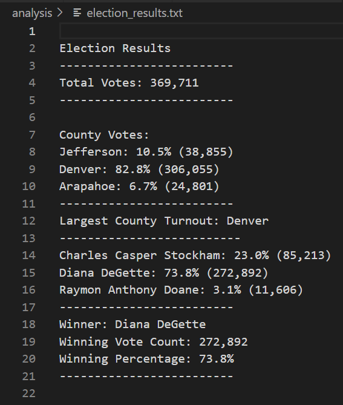

# Election_Analysis
## Overview of an Election Audit
This project audits the tabulated data of election results of the Congressional Districts in Colorado. The comission of the Colorado Board of Election needs information about votes earned by Candidates and Counties. A report was generated from the vote count data that included the following information:

1. Total number of votes cast in the election.
2. The total number of votes received from each county. 
3. The percent of the total votes each county received. 
4. Determine the county with largest turnout of votes.
5. A complete list of candidates who received votes.
6. Total number of votes each candidate received.
7. The percentage of votes received by each candidate.
8. Determine the winner of the election based on the popular votes. 

## The Purpose of the Module 3 Election Analysis 
  The purpose of this project is to learn Python programming language to extract information, do some calculation to find the coutcome from the election data provided by Colorado Board of Election. The final result is presented in a report on the computer terminal and written in a text file. The raw data is given in a csv file. We learned to open and read a _csv_ file; create and use data structures such as _lists_,  _dictionaries_ and _tuples_; make decisions using _if_ , _elif_ ; use membership operators such as _in_ and _not in_; logical operators such as _and_ and _or_; repetition statement such as _for_ loops. Finally we learned to print  information using _print_ and _f_ strings. We also learned to use **Github** to add, commit, push and pull files. While, we were not required to write it ourselves, we learned about pseudocode and its importance in planning out the programming steps.

## Resources used
- **Data Source:** election_results.csv
- **Software:** Phythos 3.7.6, Visual Studio Code 1.58.2 

## Summary of the Report and the Module 3 Challenge
 The data provided by the election commission consisted of three columns, (1) the ballot id, (2) the county name, and (3) the name of the candidate. These three column of information are sufficient to present votes garnered by each candidate in an election, the winner of the election and the county that has the most votes cast. The python program is written in the file *PyPoll_Challenge.py*, the data file, *election_results.csv* is in *Resources* folder and the output of the text file is in *Analysis/election_results.txt*. 
 
 The final election result is the output of the script shown in the screenshot of the text file (_election_results.txt_) below. 

  
The information describing the election outcome as requested by the election commission is formatted as instructed.

### Recommendations

1. This data structure and the analysis could be applied for other state offices.  It could also be generalized for federal elections. All that would be needed is to add another column for states.

 2. The data provided by the board of election can be categorized to list the votes earned by each candidate by county. The output would be: Candidate name, County name, Votes. This is useful for someone to find out which candidate has more supporters in a given county. 

3. The result could be presented in the form of a chart, such as a pie chart or bar graph for ease of evaluation.